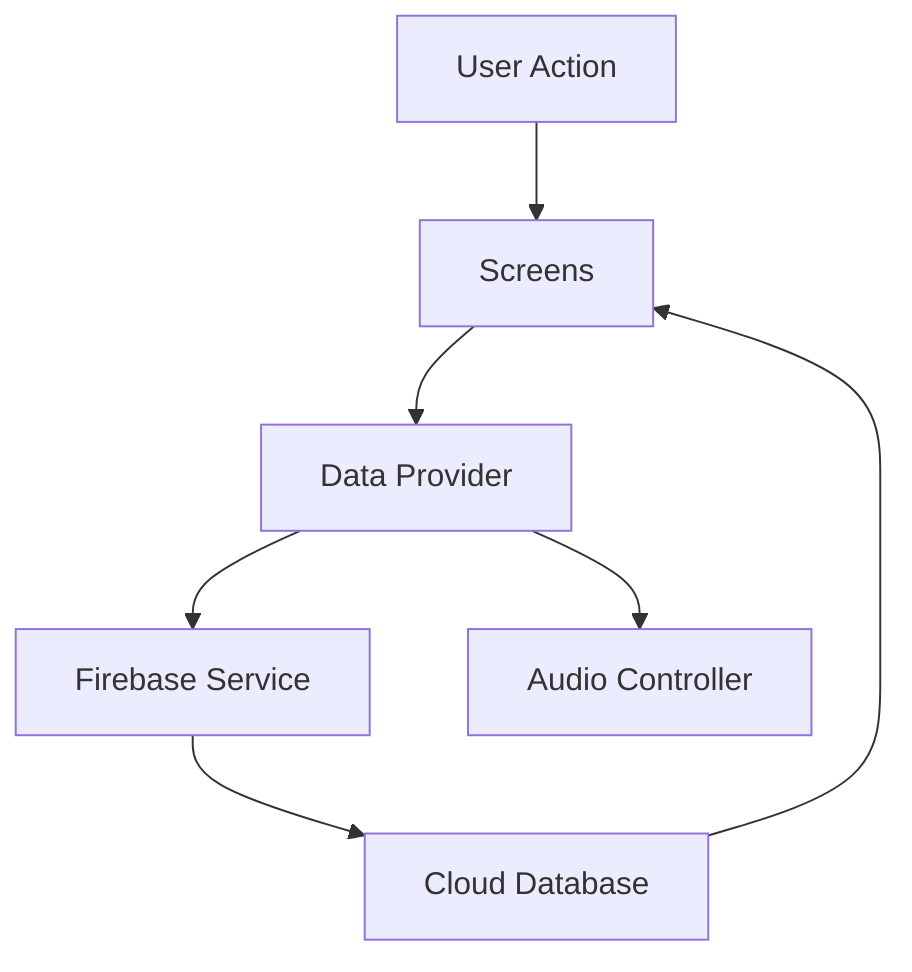
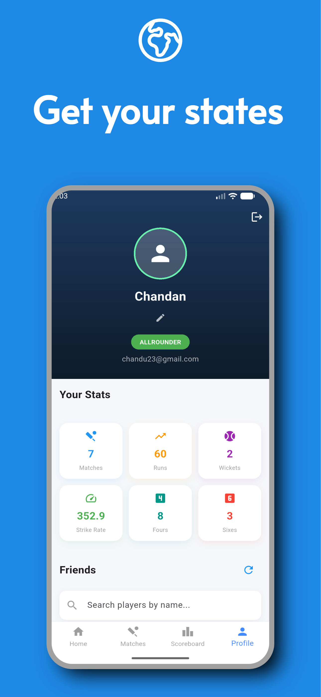
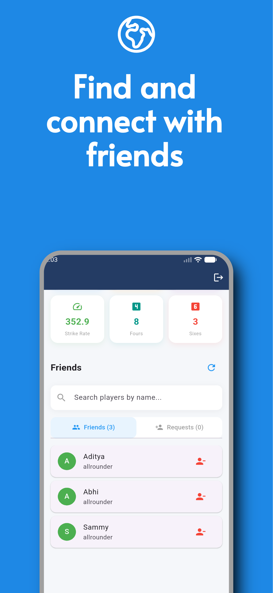
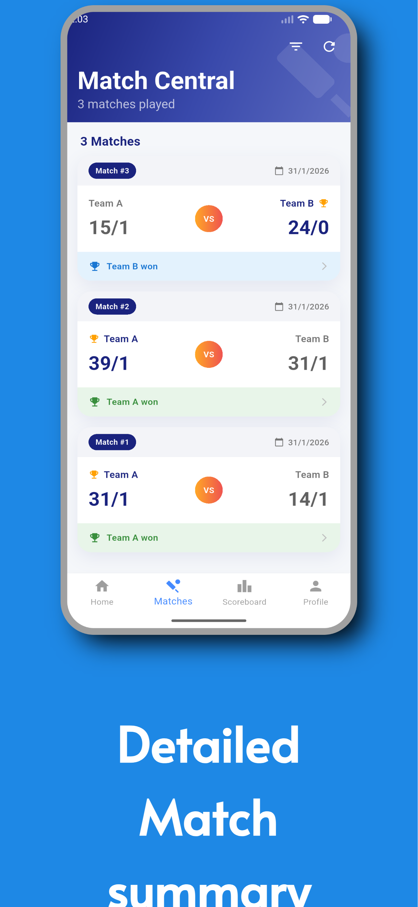
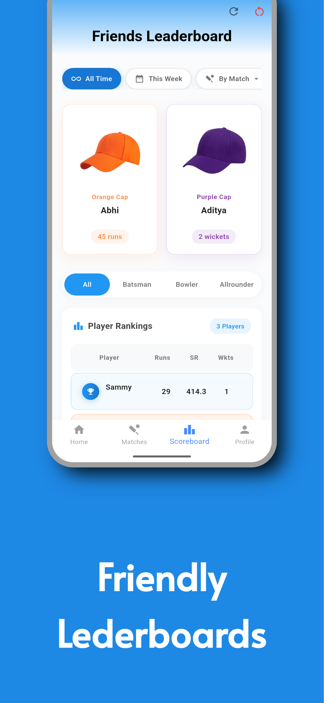
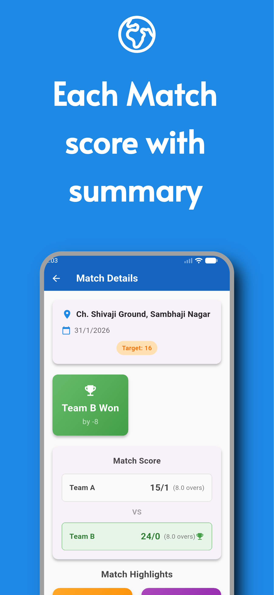
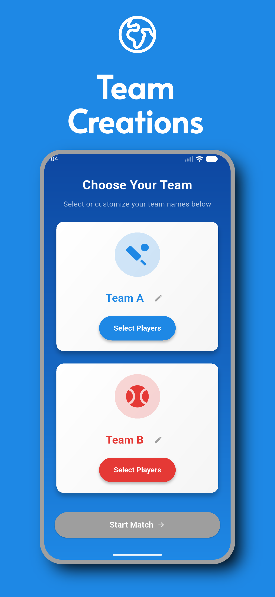
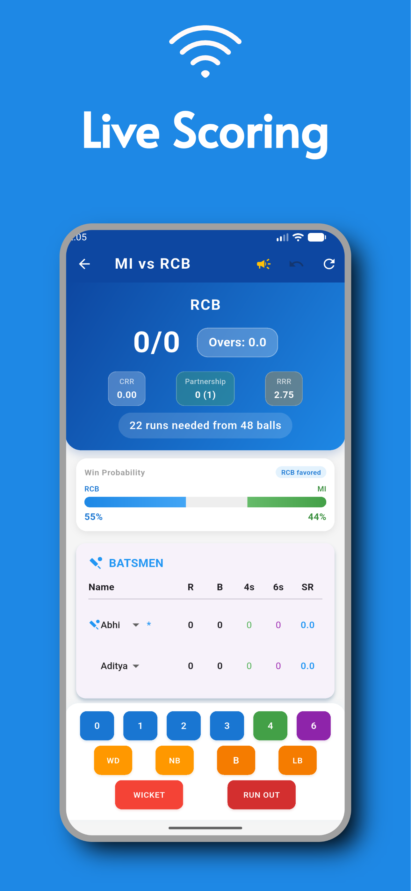
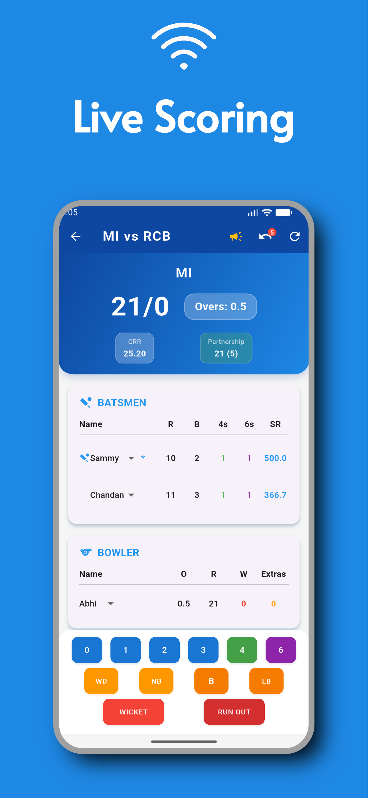
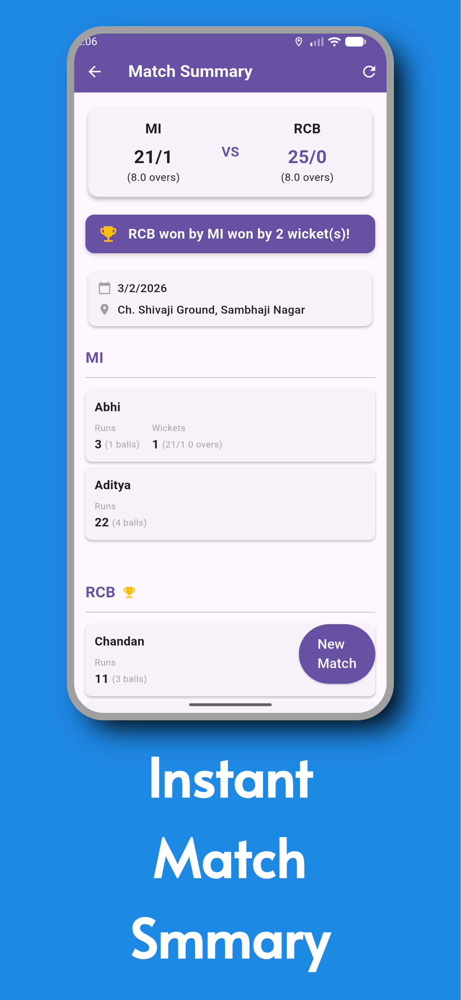

# 🏏 Cricket Scorer

<div align="center">
  
</div>

<div align="center">
  
  
  
  
  
  
  
</div>

<div align="center">
  <h3>The ultimate digital scorer for your local cricket matches</h3>
  <p>Track runs, wickets, and stats with immersive audio effects, real-time cloud stats, and a premium "Gali Cricket" experience.</p>
</div>

---

## 📋 Table of Contents

- [Features](#-features)
- [Tech Stack](#-tech-stack)
- [Architecture](#-architecture)
- [Screenshots](#-screenshots)
- [Getting Started](#-getting-started)
- [Project Structure](#-project-structure)
- [Contributing](#-contributing)
- [License](#-license)

## ✨ Features

### 🎯 Core Features
-   **Real-time Scoring**: Ball-by-ball tracking for runs, wickets, extras, and overs.
-   **Immersive Audio**: Experience the thrill with **IPL-style trumpet sounds** and effects for boundaries and wickets.
-   **Match Stats**: Auto-generated leaderboards tracking the **Orange Cap** (Most Runs) and **Purple Cap** (Most Wickets).
-   **Cloud Sync**: Changes are instantly synced to **Firebase Firestore**, ensuring no data is ever lost.
-   **Quick Toss**: Integrated digital coin toss to start matches fair and square.

### 🔧 Technical Features
-   **State Management**: Efficient state handling using **Provider** for seamless UI updates.
-   **Secure Auth**: User authentication powered by **Firebase Auth** and **Google Sign-In**.
-   **Dynamic Animations**: Engaging **Lottie** animations for key match events.
-   **Sound Engine**: Low-latency audio playback using `audioplayers`.

## 🛠️ Tech Stack

| Category | Technology |
|----------|------------|
| **Frontend** | Flutter 3.0+ (Dart) |
| **State Management** | Provider |
| **Backend** | Firebase (Auth, Firestore) |
| **Audio** | AudioPlayers |
| **Animations** | Lottie |
| **Utils** | INTl, UUID, Clipboard |

## 🏗️ Architecture

This application uses a tailored Provider-based architecture for responsiveness and simplicity:

```
lib/
├── models/               # Data Models (Match, Player, Team)
├── providers/            # State Management (MatchState, UserState)
├── screens/              # UI Screens
│   ├── auth/             # Login/Signup
│   ├── home_screen.dart  # Main Dashboard
│   ├── match_score.dart  # Scoring Interface
│   └── ...
├── services/             # Firebase & Audio Services
├── utils/                # Helper functions
└── main.dart             # Entry functionality
```

### 🔄 Data Flow



## 📱 Screenshots

<table>
  <tr>
    <td align="center">
      
      <br/>
      <sub><b>Home Dashboard</b></sub>
    </td>
    <td align="center">
      
      <br/>
      <sub><b>User Profile</b></sub>
    </td>
    <td align="center">
      
      <br/>
      <sub><b>Add Friends</b></sub>
    </td>
  </tr>
  <tr>
    <td align="center">
      
      <br/>
      <sub><b>Match Summary</b></sub>
    </td>
    <td align="center">
      
      <br/>
      <sub><b>Leaderboards</b></sub>
    </td>
    <td align="center">
      
      <br/>
      <sub><b>Detailed Summary</b></sub>
    </td>
  </tr>
  <tr>
    <td align="center">
      
      <br/>
      <sub><b>Create Teams</b></sub>
    </td>
    <td align="center">
      
      <br/>
      <sub><b>Team Creation</b></sub>
    </td>
    <td align="center">
      
      <br/>
      <sub><b>Toss Screen</b></sub>
    </td>
  </tr>
  <tr>
    <td align="center">
      
      <br/>
      <sub><b>Live Scoring</b></sub>
    </td>
    <td align="center">
      
      <br/>
      <sub><b>Scoring Action</b></sub>
    </td>
    <td align="center">
      
      <br/>
      <sub><b>Match Conclusion</b></sub>
    </td>
  </tr>
</table>

## 🚀 Getting Started

### Prerequisites

-   [Flutter SDK](https://docs.flutter.dev/get-started/install)
-   [Firebase Project](https://console.firebase.google.com/)

### Installation

1.  **Clone the repository**
    ```bash
    git clone https://github.com/yourusername/cricket_scorer.git
    cd cricket_scorer
    ```

2.  **Install dependencies**
    ```bash
    flutter pub get
    ```

3.  **Firebase Configuration**
    -   Download `google-services.json` (Android) and `GoogleService-Info.plist` (iOS) from your Firebase Console.
    -   Place them in `android/app/` and `ios/Runner/` respectively.

4.  **Run the application**
    ```bash
    flutter run
    ```

## 🤝 Contributing

Contributions are welcome! Please follow these steps:
1.  Fork the project.
2.  Create your feature branch (`git checkout -b feature/AmazingFeature`).
3.  Commit your changes (`git commit -m 'Add some AmazingFeature'`).
4.  Push to the branch (`git push origin feature/AmazingFeature`).
5.  Open a Pull Request.

## 📄 License

This project is licensed under the MIT License - see the [LICENSE](LICENSE) file for details.

---

<div align="center">
  <p>Made with ❤️ by <strong>Aditya Magar</strong></p>
</div>
